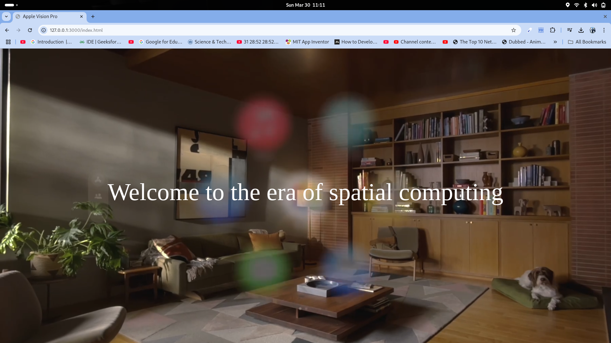
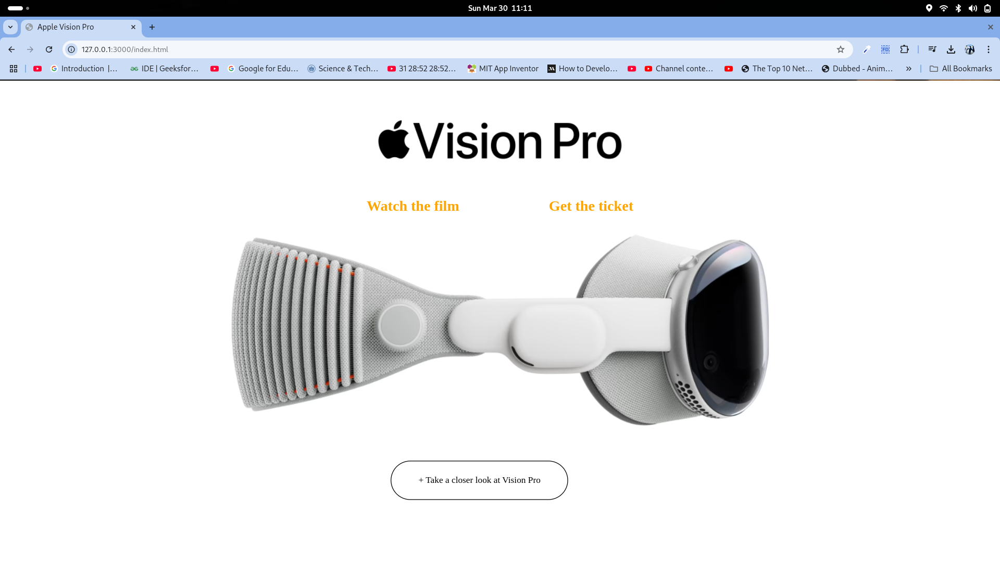
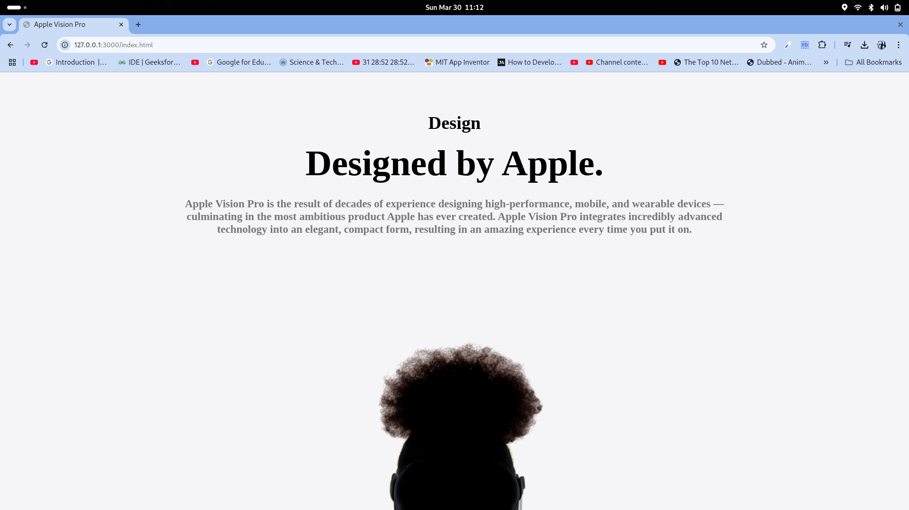
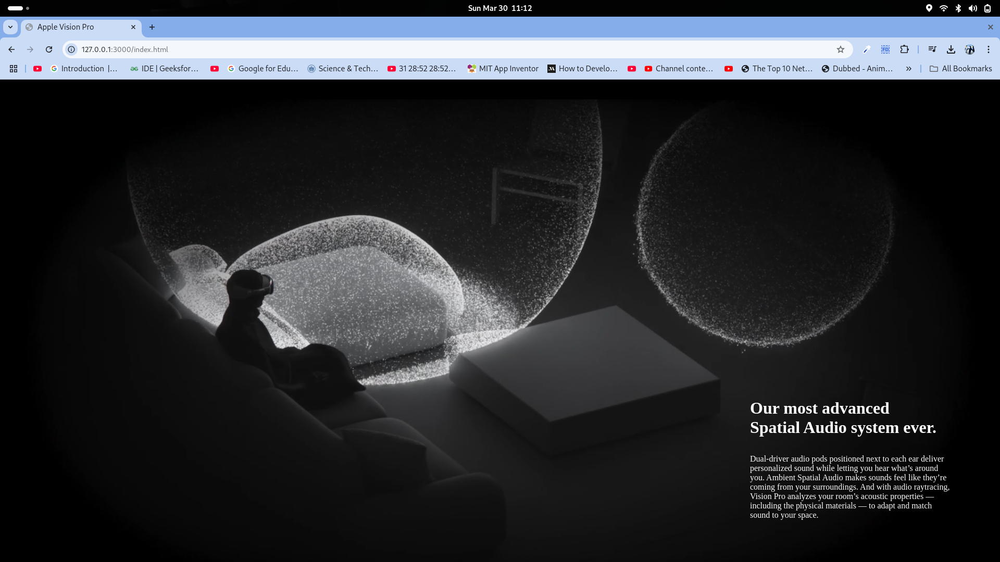

# Apple Vision Pro Website Clone - FrontEnd

A visually stunning and interactive clone of the Apple Vision Pro website built using **HTML, CSS, and JavaScript**, with **GSAP, Locomotive Scroll, and Canvas** for smooth animations and dynamic effects.

## 🪧 Live Website

https://sidd190.github.io/apple-vision-pro-clone/
[Give it a bit of time to load, it's a bit asset heavy :( ..]

## 🚀 Features

- **Smooth Scrolling** – Implemented with Locomotive Scroll for a seamless user experience.
- **GSAP Animations** – Engaging scroll-based and element animations.
- **Canvas Effects** – High-performance graphical effects using the HTML5 Canvas API.
- **Optimized Performance (not yet)** – Efficient animations and optimized asset loading.

## 📂 Project Structure

```
📁 apple-vision-pro-clone
│── 📁 assets          # Images, fonts, and other assets
│── 📄 style.css       # Stylesheet
│── 📄 script.js       # Js Script
│── 📄 index.html      # Main HTML file
│── 📄 README.md       # Project documentation
```

## 🛠️ Technologies Used

- **HTML5** – Structuring the content
- **CSS3** – Styling and layout
- **JavaScript (ES6+)** – Dynamic interactions
- **GSAP (GreenSock)** – Animation library for smooth transitions
- **Locomotive Scroll** – Enhancing scroll experience
- **Canvas API** – Custom graphics rendering

## 📌 Installation & Usage

1. Clone the repository:
   ```bash
   git clone https://github.com/yourusername/apple-vision-pro-clone.git
   ```
2. Navigate to the project folder:
   ```bash
   cd apple-vision-pro-clone
   ```
3. Open `index.html` in a browser or use Live Server in VS Code for best results.

## 📷 Screenshots






## 📝 License

This project is for educational purposes and not affiliated with Apple. Feel free to use and modify the code.

## 📬 Contact

If you have any questions or suggestions, feel free to reach out!
sidd190bansal@gmail.com


👨‍💻 Created by **[Siddharth Bansal]**


